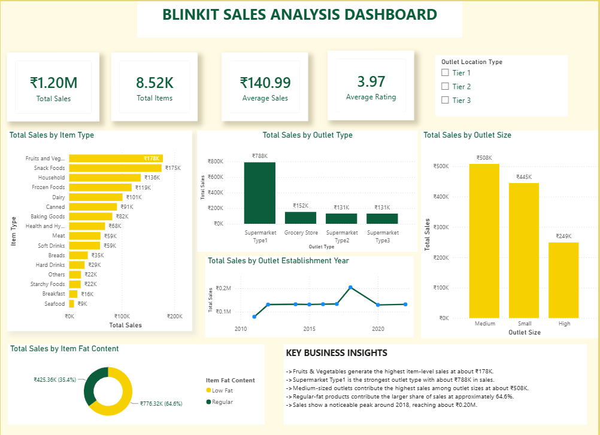
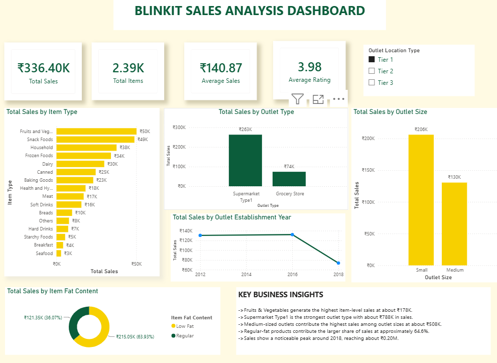
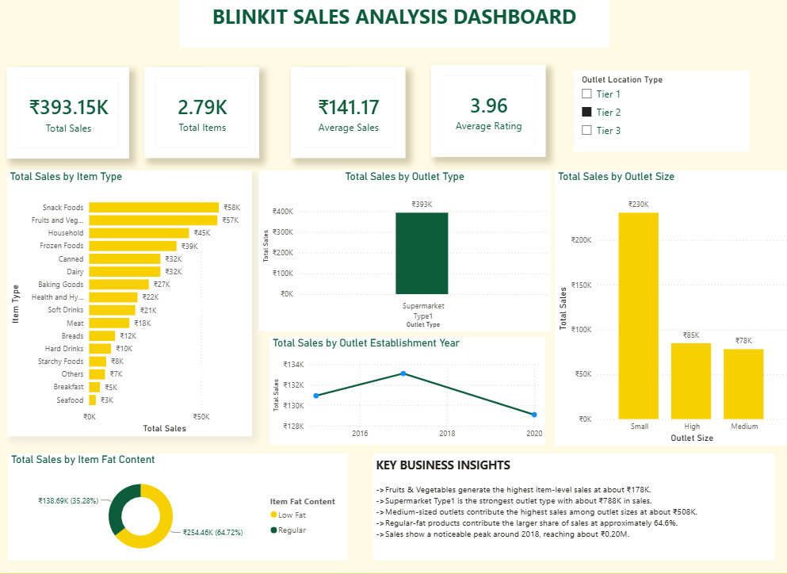
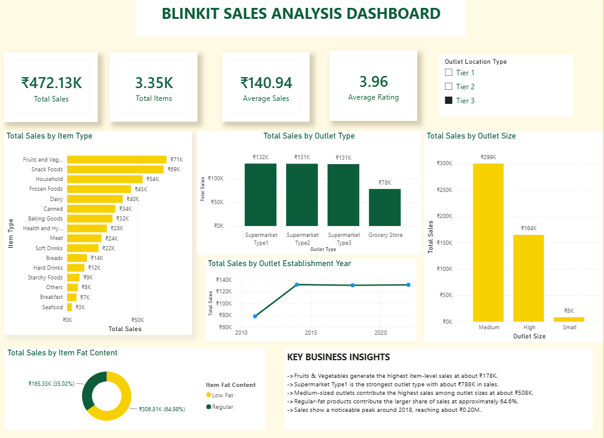

# 🛒 Blinkit Sales Analysis

An end-to-end Data Analytics project that analyzes **8,523 Blinkit product records** using **Python, SQL, and Power BI** to uncover sales trends, outlet performance, product patterns, and business insights.

---

## 📌 Project Overview

This project aims to analyze Blinkit sales data to understand product performance, outlet characteristics, sales trends, and customer-related patterns through data analysis and an interactive Power BI dashboard.

---

## 📂 Dataset

- Total Records: **8,523**
- Outlet Location Types: **Tier 1, Tier 2 & Tier 3**
- Features: **12**

---

## 🛠️ Tools & Technologies

- Python
- Pandas
- NumPy
- Matplotlib
- Seaborn
- MySQL
- Power BI
- DAX
- Git & GitHub

---

## 🧹 Data Cleaning

- Checked missing values
- Checked duplicate records
- Corrected data types
- Cleaned categorical values
- Prepared numerical columns
- Created a cleaned dataset for analysis

---

## 📊 Exploratory Data Analysis

Performed analysis on:

- Sales by Item Type
- Sales by Outlet Type
- Sales by Outlet Size
- Sales by Outlet Location Type
- Sales by Establishment Year
- Sales by Fat Content
- Item Visibility vs Sales
- Rating vs Sales

---

## 📈 Power BI Dashboard

### KPI Cards

- Total Sales
- Total Items
- Average Sales
- Average Rating

### Dashboard Visuals

- Sales by Item Type
- Sales by Outlet Type
- Sales by Outlet Size
- Sales by Item Fat Content
- Sales by Outlet Establishment Year
- Outlet Location Type Slicer

---

## 📷 Dashboard Preview

### Complete Dashboard



### Tier 1 Analysis



### Tier 2 Analysis



### Tier 3 Analysis



---

## 💡 Key Business Insights

- **Fruits & Vegetables** generate the highest item-level sales at approximately **₹178K**.
- **Supermarket Type1** is the highest-performing outlet type with approximately **₹788K** in sales.
- **Medium-sized outlets** generate the highest sales among outlet sizes at approximately **₹508K**.
- **Regular-fat products** contribute approximately **64.6%** of sales.
- Sales show a noticeable peak around **2018**, reaching approximately **₹0.20M**.
- Item visibility and rating were analyzed against sales to understand their relationship with sales performance.

---

## 📁 Repository Structure

```text
Blinkit-Sales-Analysis/
│
├── Dataset/
│   └── blinkit_cleaned.csv
│
├── Python/
│   └── Blinkit_Sales_Analysis.ipynb
│
├── SQL/
│   └── Blinkit_Sales_Analysis.sql
│
├── PowerBI/
│   └── Blinkit_Sales_Analysis_Dashboard.pbix
│
├── images/
│   ├── powerbi_dashboard.png
│   ├── powerbi_tier1.png
│   ├── powerbi_tier2.png
│   └── powerbi_tier3.png
│
└── README.md


